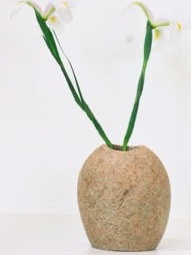
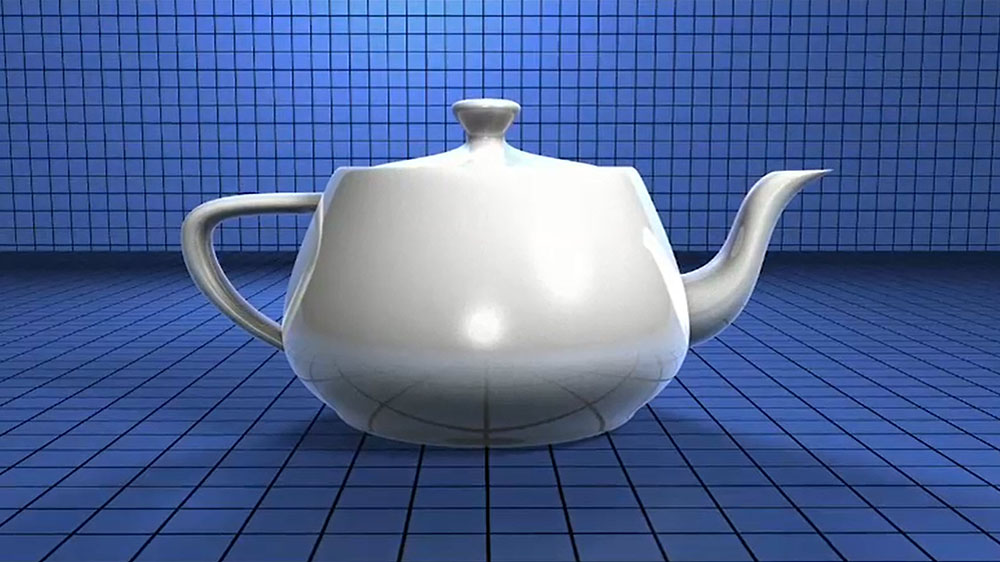
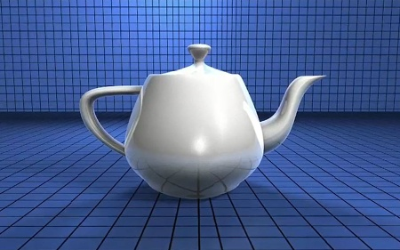
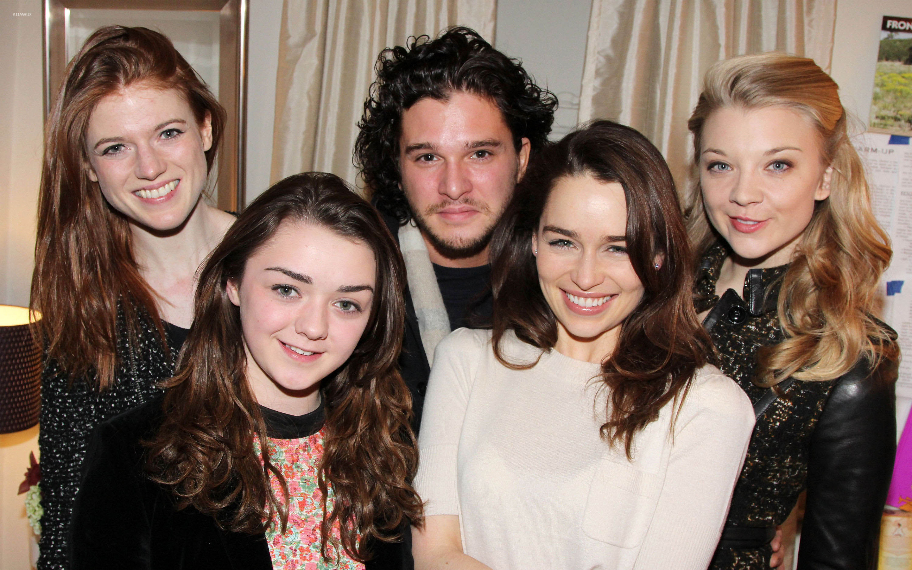
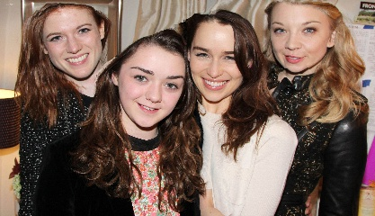

# seam-carving-with-pyqt5
## Table of contents
- Introduce
- Experimental settings
- Product
- Illustrating images
- Reference link and thanks

## Introduce

This is a demo product for a report on **Image Processing and Applications - CS406.M11.KHCL**.

The product implementation team consists of 2 members:
- Nguyen Xuan Dinh - 18520603
- Nguyen Ngoc Binh - 18520506

The product consists of two main parts, **simulation** and **evaluation** of the **seamcarving algorithm**.

For more detailed information about the seamcarving algorithm, you can check out the algorithm's original paper:
- [Seam Carving](https://faculty.idc.ac.il/arik/SCWeb/imret/index.html)
- [Improved Seam Carving](https://faculty.idc.ac.il/arik/SCWeb/vidret/index.html)

## Experimental settings
- Experiment and evaluate seamcarving algorithm [on colab](https://colab.research.google.com/drive/1ebC9-DeITIL5oFGpGceeHhFZHut1hnBj?usp=sharing)
- Dataset used for experiment: [MSRA10K](https://mmcheng.net/msra10k/)

## Product demo
- Compressed file containing seamcarving program with exe extension: [seamcarving_v2.0.rar](https://drive.google.com/file/d/1cTlWcAjq4gvWBo3R0YrccqHc7E0zmTXX/view?usp=sharing)
- Just download, extract and run the exe file to be able to start using it on windows operating systems.

## Illustrating images
- Some results before and after seamcarving.

## Reference link and thanks

Articles about seamcarving:
- https://www.youtube.com/watch?v=rpB6zQNsbFUND
- https://vnoi.info/wiki/cs/imageprocessing/Seam-Carving.md
- https://avikdas.com/2019/07/29/improved-seam-carving-with-forward-energy.html?fbclid=IwAR2IBEFqflEWKSh2KF1ND7OmKP0L31By0-Cfg-1BSp2SwUmX4k3W3xHAriQ
- https://karthikkaranth.me/blog/implementing-seam-carving-with-python/

The seamcarving code github repo:
- https://github.com/li-plus/seam-carving
- https://github.com/andrewdcampbell/seam-carving
- https://github.com/vivianhylee/seam-carving
- https://github.com/axu2/improved-seam-carving

PyQt5 Programming Guide:
- https://www.youtube.com/playlist?list=PLzMcBGfZo4-lB8MZfHPLTEHO9zJDDLpYj
- https://www.youtube.com/playlist?list=PLCC34OHNcOtpmCA8s_dpPMvQLyHbvxocY

### **Sincere thanks to the authors of the above articles, articles, source code and video tutorials for helping the team to carry out this project !!**